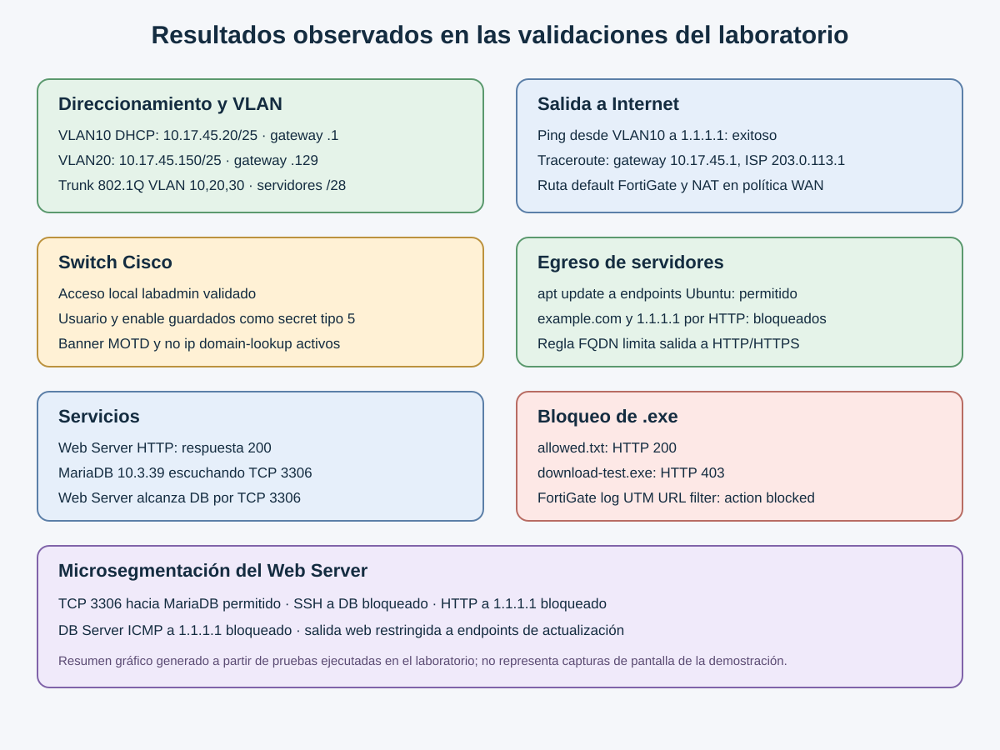

# Primer Parcial — Seguridad de Redes

Video de demostración: https://youtu.be/SAxDl47GXZA

Laboratorio de segmentación de usuarios y servidores, control de salida y validación de políticas mediante FortiGate, Cisco IOSvL2 y servidores Linux en PNETLab.

## Topología

## Direccionamiento

| Zona | VLAN | Red | Gateway | Equipos |
|---|---:|---|---|---|
| Usuarios | 10 | `10.17.45.0/25` | `10.17.45.1` | PC VLAN 10 por DHCP; asignación observada `10.17.45.20` |
| Administrativa | 20 | `10.17.45.128/25` | `10.17.45.129` | PC VLAN 20 `10.17.45.150`; SVI switch `10.17.45.130` |
| Servidores | 30 | `10.17.46.0/28` | `10.17.46.1` | Web `10.17.46.2`; MariaDB `10.17.46.3` |
| Sucursal | — | `10.17.47.0/28` | `10.17.47.1` | PC sucursal `10.17.47.2` |
| WAN principal | — | `203.0.113.0/30` | `203.0.113.1` | FortiGate HQ `203.0.113.2` |
| WAN sucursal | — | `198.51.100.0/30` | `198.51.100.1` | FortiGate sucursal `198.51.100.2` |

La interfaz `Gi0/0` del switch transporta las VLAN 10, 20 y 30 mediante 802.1Q. Los puertos `Gi0/1`, `Gi0/2`, `Gi0/3` y `Gi1/0` conectan, respectivamente, Web Server, PC VLAN 20, PC VLAN 10 y MariaDB.

## Controles implementados y verificados

- El FortiGate HQ entrega DHCP a VLAN 10 y usa una ruta por defecto hacia el router ISP con NAT para las redes de usuarios.
- Los PCs están segmentados en VLAN 10 y VLAN 20. La red de servidores usa VLAN 30 y prefijo `/28`.
- El switch tiene usuario local, banner MOTD y `no ip domain-lookup`. Las claves se guardan con secreto tipo 5 en el equipo.
- Web Server responde por HTTP. MariaDB 10.3.39 escucha en TCP 3306.
- Los servidores pueden actualizar desde `archive.ubuntu.com` y `security.ubuntu.com` por HTTP/HTTPS; destinos externos no autorizados fallan.
- FortiGate aplica el filtro URL `*.exe`: `allowed.txt` respondió HTTP 200 y `download-test.exe` respondió HTTP 403. El registro UTM mostró `action="blocked"`.
- Web Server puede abrir TCP 3306 hacia MariaDB. SSH de Web Server a DB, HTTP desde Web Server a `1.1.1.1` e ICMP desde DB a `1.1.1.1` fueron bloqueados.
- El túnel IPsec IKEv2 entre los FortiGate está activo y la sucursal puede llegar por HTTP al Web Server.



## Configuraciones

El archivo `lab/Primer Parcial.unl` contiene la topología exportada para PNETLab. Los archivos de `configuraciones/` corresponden a los equipos de red del laboratorio: FortiGate HQ, FortiGate de sucursal, switch IOSvL2 y nodo ISP Linux. Se excluyeron las claves administrativas y la clave compartida IPsec de los archivos publicados.

El túnel IPsec activo negocia DES/SHA-1 porque esta imagen de FortiOS solo ofrece esas propuestas en el laboratorio. Es una limitación de la imagen y no una configuración recomendada para producción.

## Estructura

```text
README.md
lab/
  Primer Parcial.unl
configuraciones/
  fortigate-hq.conf
  fortigate-branch.conf
  isp-router-linux.sh
  switch-iosvl2.cfg
imagenes/
  topologia-primer-parcial.png
  validaciones-observadas.svg
```
